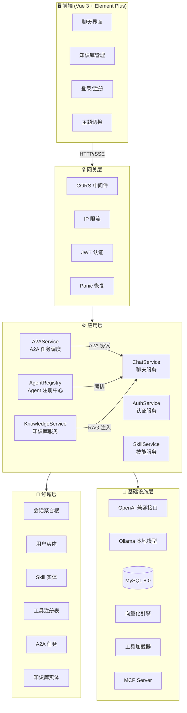

<p align="center">
  <h1 align="center">🤖 AI Agent Platform</h1>
  <p align="center">
    基于 Go 构建的本地化 AI 智能体平台，支持多模型、多 Agent 编排、RAG 知识库、Function Calling 和 A2A 协议
  </p>
  <p align="center">
    
    
    
    
    
    
  </p>
</p>

---

## 🌟 Feature Highlights

<table>
<tr>
<td width="50%">

**🧠 多模型 & 多 Agent 编排**

同时接入云端模型（DashScope / OpenAI 兼容）与本地 Ollama 模型。主 Agent 自动拆解任务，编排子 Agent 协同完成复杂工作，思考/工具调用过程实时透传。

</td>
<td width="50%">

**🔧 ReAct 工具调用**

基于 ReAct 循环架构，AI 自主决策调用 10+ 内置工具（天气、HTTP、命令执行、文件操作、MySQL 等），支持并发执行，最多 5 轮自动迭代。

</td>
</tr>
<tr>
<td width="50%">

**📚 RAG 知识库**

文档上传 → 智能分块 → 向量化 → 语义检索。支持 `.txt` / `.md` / `.pdf`，基于余弦相似度的 Top-K 检索增强 AI 回答准确性。

</td>
<td width="50%">

**🔗 A2A & MCP 协议**

实现 Google A2A 协议（Agent 间通信）和 Anthropic MCP 协议（模型上下文），支持任务提交、SSE 流式订阅、AgentCard 能力发现。

</td>
</tr>
</table>

---

## 📖 目录

- [功能概览](#-功能概览)
- [系统架构](#-系统架构)
- [快速开始](#-快速开始)
- [技术栈](#-技术栈)
- [项目结构](#-项目结构)
- [详细文档](#-详细文档)
- [Roadmap](#-roadmap)
- [Contributing](#-contributing)
- [许可证](#-许可证)

---

## ✨ 功能概览

### 🧠 AI 核心能力

| 功能 | 说明 |
|------|------|
| **多模型切换** | 同时接入云端模型（阿里云 DashScope / OpenAI 兼容接口）与本地 Ollama 模型，运行时自由切换 |
| **Function Calling** | ReAct 循环架构，AI 自主决策调用工具（计算器、天气、HTTP、命令执行、文件操作、MySQL 等） |
| **多 Agent 编排** | 主 Agent 编排多个子 Agent 协同完成复杂任务，思考/工具调用过程实时透传 |
| **RAG 知识库** | 文档上传 → 自动分块 → 向量化 → 语义检索，增强 AI 回答的准确性 |
| **Skill 技能系统** | 通过 `SKILL.md` 定义 AI 角色与行为，支持 5 种设计模式 |
| **SSE 流式输出** | 实时推送 AI 回复、思考过程、工具调用过程 |

### 🔗 协议支持

| 协议 | 说明 |
|------|------|
| **A2A（Agent-to-Agent）** | Google 提出的 Agent 间通信协议，支持任务提交、状态查询、SSE 流式订阅 |
| **MCP（Model Context Protocol）** | Anthropic 提出的模型上下文协议，提供标准化工具接口 |

### 👥 平台功能

| 功能 | 说明 |
|------|------|
| **多用户权限** | 三级角色（admin / user / guest），精细化权限控制 |
| **多会话管理** | 多会话并行、历史记录持久化、标题自动生成、会话重命名 |
| **Token 统计** | 按用户、按模型统计 Token 消耗 |
| **暗色主题** | 支持亮色/暗色主题切换，自动记忆用户偏好 |
| **知识库管理** | 可视化知识库管理页面，支持文档上传、删除、语义搜索 |
| **IP 限流** | 基于令牌桶的 IP 级限流，防止恶意请求 |

---

## 🏗️ 系统架构



> 📊 更多流程图（聊天时序图、多 Agent 编排、RAG 处理流程、A2A 任务流程等）请查看 **[核心流程图集](docs/flowcharts.md)**

---

## 🚀 快速开始

### 前置要求

| 依赖 | 版本 | 说明 |
|------|------|------|
| Go | 1.24+ | 后端运行时 |
| MySQL | 8.0+ | 数据持久化 |
| Python 3 | 3.8+ | Skill 脚本工具执行 |
| Ollama | 可选 | 本地模型推理 |

### 1. 克隆 & 安装依赖

```bash
git clone https://github.com/JayCoding0/ai-tool.git
cd ai-tool
go mod tidy
```

### 2. 初始化数据库

```bash
# 建库 + 建表
mysql -u root -p < database/schema.sql
# 插入预设数据（admin 账户 + 系统预设技能）
mysql -u root -p ai_chat_db < database/seed.sql
```

### 3. 配置

```bash
cp trpc_go.yaml.example trpc_go.yaml
```

编辑 `trpc_go.yaml`，填写关键配置：

```yaml
custom:
  model:
    openai_api_key: "YOUR_API_KEY"        # ⚠️ 必填：AI 模型 API Key
    openai_base_url: "https://dashscope.aliyuncs.com/compatible-mode/v1"
  server:
    http_port: 8080                        # HTTP 服务端口
    mcp_port: 8001                         # MCP 服务端口
  rag:
    enabled: true                          # 启用 RAG 知识库
```

> 完整配置说明见 [docs/configuration.md](docs/configuration.md)

### 4. 启动

```bash
# 方式一：脚本启动（推荐）
./scripts/start.sh          # 生产模式
./scripts/start.sh --dev    # 开发模式

# 方式二：直接运行
go run main.go

# 方式三：Docker 一键部署（Nginx + 应用 + MySQL）
cp .env.example .env
docker-compose up -d
```

访问 [http://localhost:8080](http://localhost:8080) 🎉

> 默认管理员账户：`admin` / `admin123`（**请及时修改密码**）

### 运维脚本

```bash
./scripts/start.sh          # 启动（--dev 开发模式 / --prod 生产模式）
./scripts/stop.sh           # 停止（--force 强制终止）
./scripts/restart.sh        # 重启（透传所有参数）
```

> 详细部署方案（Docker、Systemd、Nginx 反代等）见 [docs/deployment.md](docs/deployment.md)

---

## 🛠️ 技术栈

### 后端

| 技术 | 用途 |
|------|------|
| **Go 1.24+** | 主语言 |
| **TRPC-GO** | 服务框架 |
| **MySQL 8.0** | 数据持久化 |
| **JWT** | 用户认证 |
| **SSE** | 流式推送 |
| **DDD 分层架构** | 代码组织 |

### 前端

| 技术 | 用途 |
|------|------|
| **Vue 3** | UI 框架（CDN 引入，零构建） |
| **Element Plus** | UI 组件库 |
| **marked.js** | Markdown 渲染 |
| **highlight.js** | 代码高亮 |
| **SSE** | 流式接收 |

### AI & 协议

| 技术 | 用途 |
|------|------|
| **OpenAI 兼容接口** | 云端模型（DashScope 等） |
| **Ollama** | 本地模型推理 |
| **A2A 协议** | Agent 间通信 |
| **MCP 协议** | 模型上下文协议 |
| **ReAct 循环** | 工具调用决策 |
| **RAG** | 检索增强生成 |

---

## 📁 项目结构

```
aiProject/
├── main.go                              # 程序入口
├── trpc_go.yaml.example                 # 配置文件模板
├── frontend/                            # 🖥️ 前端（Vue 3 CDN，零构建）
│   ├── index.html                       # 主聊天界面
│   ├── login.html                       # 登录/注册页面
│   ├── knowledge.html                   # 知识库管理页面
│   ├── style.css                        # 全局样式（含暗色主题）
│   └── js/                              # 模块化 JS（10 个模块）
├── internal/                            # ⚙️ 后端核心（DDD 分层）
│   ├── bootstrap/                       # 启动编排（路由、中间件、Agent 注册）
│   ├── application/                     # 应用层（ChatService、AuthService、A2A 等）
│   ├── domain/                          # 领域层（实体、聚合根、仓储接口）
│   ├── infrastructure/                  # 基础设施层（MySQL、OpenAI、Ollama、向量化）
│   ├── interfaces/                      # 接口层（HTTP Handler、MCP Server）
│   ├── config/                          # 配置管理
│   └── shared/                          # 共享工具（日志等）
├── skills/                              # 🎯 内置 Skill 技能（10 个）
│   ├── weather/                         # 天气查询
│   ├── calculate/                       # 数学计算
│   ├── execute-command/                 # 命令执行
│   ├── http-request/                    # HTTP 请求
│   ├── mysql-query/                     # MySQL 查询
│   ├── write-file/                      # 文件写入
│   ├── file-explorer/                   # 文件浏览
│   ├── current-time/                    # 当前时间
│   ├── ip-lookup/                       # IP 查询
│   └── skill-creator/                   # Skill 生成器（元技能）
├── nginx/                               # 🌐 Nginx 配置（前端 + 反向代理）
├── scripts/                             # 🔧 运维脚本（启动/停止/重启）
├── database/                            # 🗄️ 数据库脚本（schema + seed）
├── Dockerfile                           # 🐳 Docker 多阶段构建
├── docker-compose.yml                   # 🐳 Docker Compose 编排
└── docs/                                # 📚 详细文档（8 篇）
```

> 完整目录结构见 [docs/architecture.md](docs/architecture.md)

---

## 📚 详细文档

> 为保持主 README 精简，详细文档已拆分到 `docs/` 目录：

| 文档 | 说明 |
|------|------|
| [🏗️ 架构设计详解](docs/architecture.md) | DDD 分层架构、数据库 ER 图、组件依赖关系、中间件链、安全机制 |
| [🔄 核心流程图集](docs/flowcharts.md) | 聊天时序图、多 Agent 编排、RAG 处理流程、A2A 任务流程、认证流程 |
| [📡 API 接口文档](docs/api-reference.md) | 完整 REST API 参考，含请求/响应示例、SSE 事件类型 |
| [🎯 Skill 开发指南](docs/skill-guide.md) | Skill 目录结构、SKILL.md 格式、5 种设计模式、工具开发 |
| [🤖 多 Agent 编排指南](docs/agent-orchestration.md) | Agent 注册、主/子 Agent 配置、call_agent 工具、动态工具管理 |
| [⚙️ 配置说明](docs/configuration.md) | 完整配置项说明、模型类型判断规则、环境变量 |
| [🚀 部署指南](docs/deployment.md) | 生产环境部署、Docker、Nginx 前端配置、安全加固 |
| [🖥️ 前端功能说明](docs/frontend-guide.md) | 页面功能模块、模块化设计、主题系统 |

---

## 🗺️ Roadmap

- [x] 多模型切换（云端 + 本地 Ollama）
- [x] ReAct 工具调用循环
- [x] 多 Agent 编排（主/子 Agent 模式）
- [x] RAG 知识库（文档上传 + 语义检索）
- [x] A2A 协议支持
- [x] MCP 协议支持
- [x] 多用户权限系统
- [x] 暗色主题
- [ ] 对话导出（Markdown / PDF）
- [ ] 插件市场（Skill 在线安装）
- [ ] 多模态支持（图片理解 / 生成）
- [ ] WebSocket 替代 SSE
- [ ] Agent 可视化编排界面
- [ ] 更多向量数据库支持（Milvus / Qdrant）

---

## 🤝 Contributing

欢迎贡献代码！请遵循以下步骤：

1. Fork 本仓库
2. 创建特性分支：`git checkout -b feat/amazing-feature`
3. 提交更改：`git commit -m 'feat(scope): add amazing feature'`
4. 推送分支：`git push origin feat/amazing-feature`
5. 提交 Pull Request

> 💡 Commit Message 请遵循 [Conventional Commits](https://www.conventionalcommits.org/) 规范。

---

## 📄 许可证

[MIT License](LICENSE)