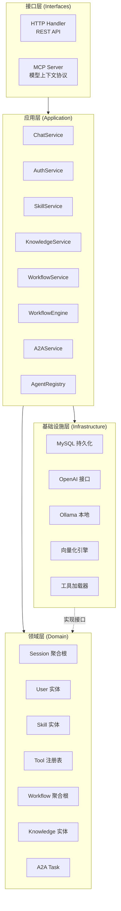
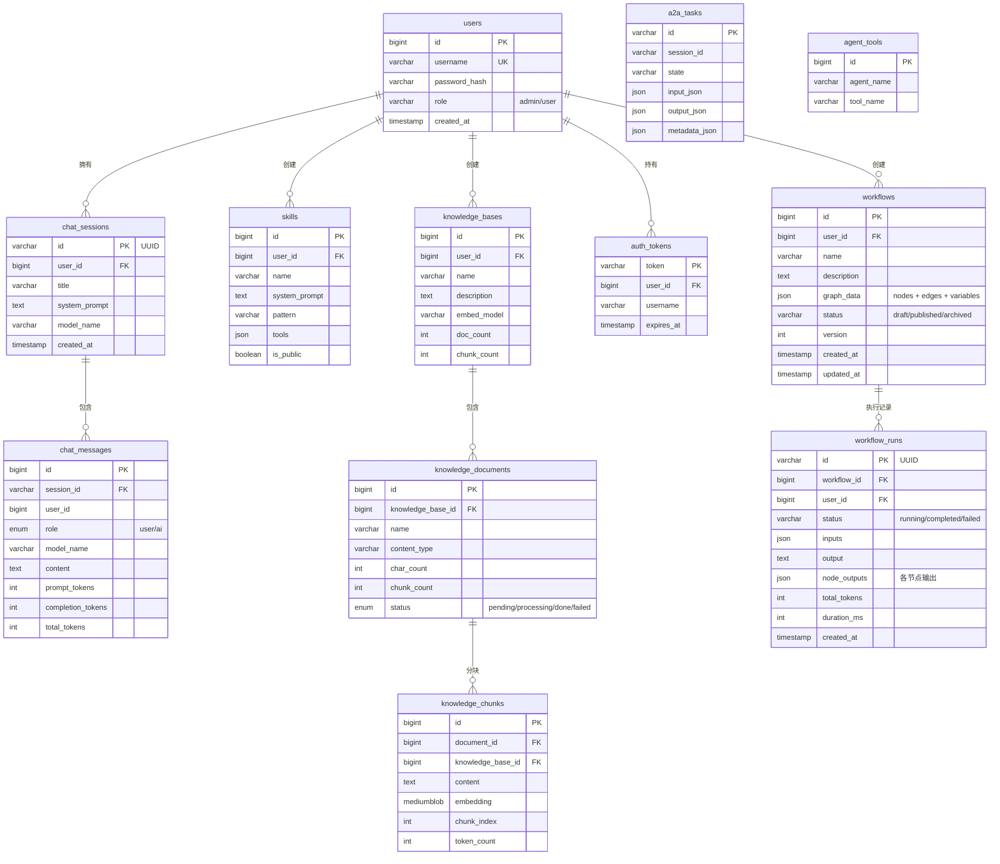
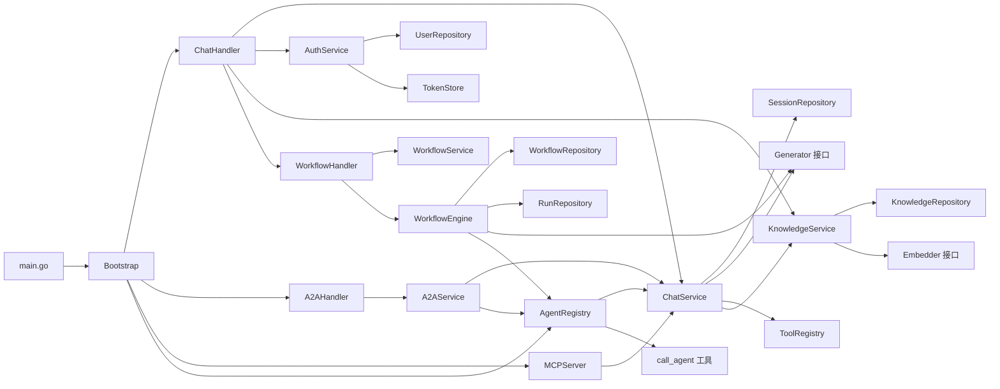

# 🏗️ 架构设计详解

## DDD 分层架构

本项目采用 **领域驱动设计（DDD）** 分层架构，各层职责清晰，依赖方向严格从外向内。



### 各层职责

| 层 | 目录 | 职责 |
|----|------|------|
| **接口层** | `internal/interfaces/` | 处理 HTTP 请求、协议适配（REST、MCP、A2A），不含业务逻辑 |
| **应用层** | `internal/application/` | 编排领域对象完成用例，事务管理，不含业务规则（含 WorkflowEngine DAG 执行引擎） |
| **领域层** | `internal/domain/` | 核心业务逻辑，定义实体、值对象、聚合根、仓储接口 |
| **基础设施层** | `internal/infrastructure/` | 技术实现：数据库、外部 API、工具执行、向量化 |
| **启动编排层** | `internal/bootstrap/` | 依赖注入、组件初始化、路由注册、中间件链 |

---

## 数据库 ER 图



---

## 组件依赖关系



---

## 中间件链

请求经过的中间件链（从外到内）：

```
HTTP Request
    │
    ▼
┌─────────────────────┐
│  Recovery 中间件      │  ← panic 恢复，防止单请求崩溃导致服务宕机
├─────────────────────┤
│  Logging 中间件       │  ← 记录请求日志（IP、方法、路径、状态码、耗时）
├─────────────────────┤
│  RateLimit 中间件     │  ← 基于 IP 的令牌桶限流（可配置开关）
├─────────────────────┤
│  CORS 中间件          │  ← 跨域控制（从配置读取允许的 Origin）
├─────────────────────┤
│  JWT 认证（Handler级） │  ← 在 Handler 内部校验 Token，区分角色权限
└─────────────────────┘
    │
    ▼
  Handler
```

---

## 安全机制

| 机制 | 说明 |
|------|------|
| **JWT Token 认证** | 支持 Cookie 和 Authorization Header 双通道 |
| **密码哈希** | bcrypt 加密存储 |
| **脚本沙箱** | 路径白名单校验，防止路径穿越攻击 |
| **执行超时** | 单次脚本执行超时 30 秒 |
| **输出限制** | 脚本输出大小限制 512 KB |
| **进程隔离** | 进程组隔离，超时后 kill 整个子进程树 |
| **IP 限流** | 令牌桶算法，支持配置 RPS 和突发上限 |
| **CORS 控制** | 从配置文件读取允许的 Origin，不硬编码 `*` |
| **游客清理** | 定期自动清理游客会话（user_id=0） |
