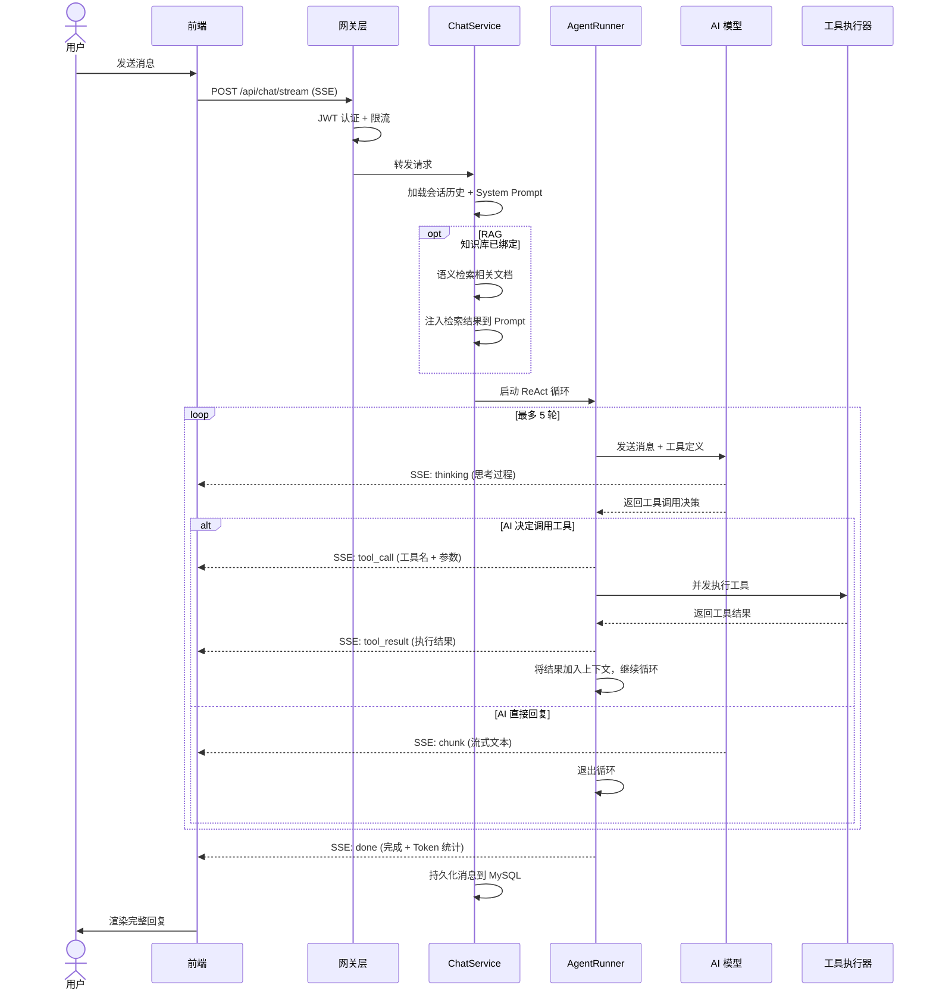
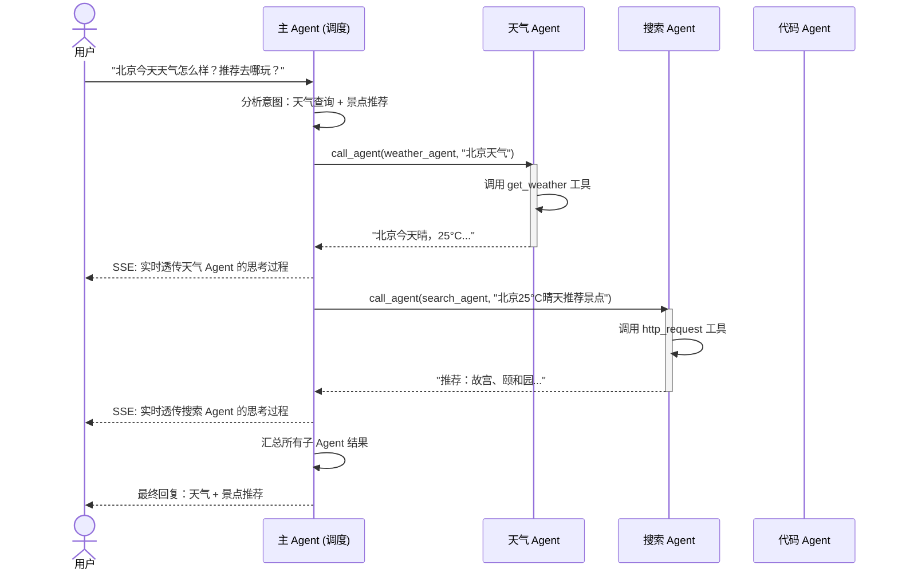
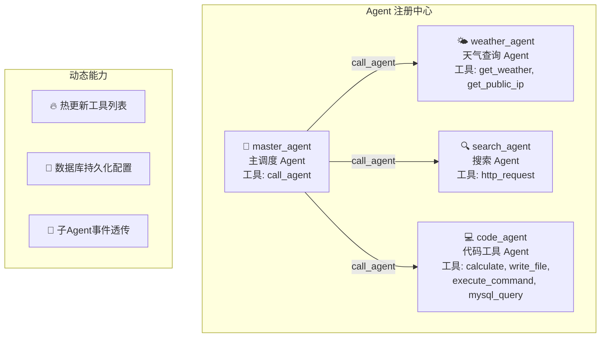
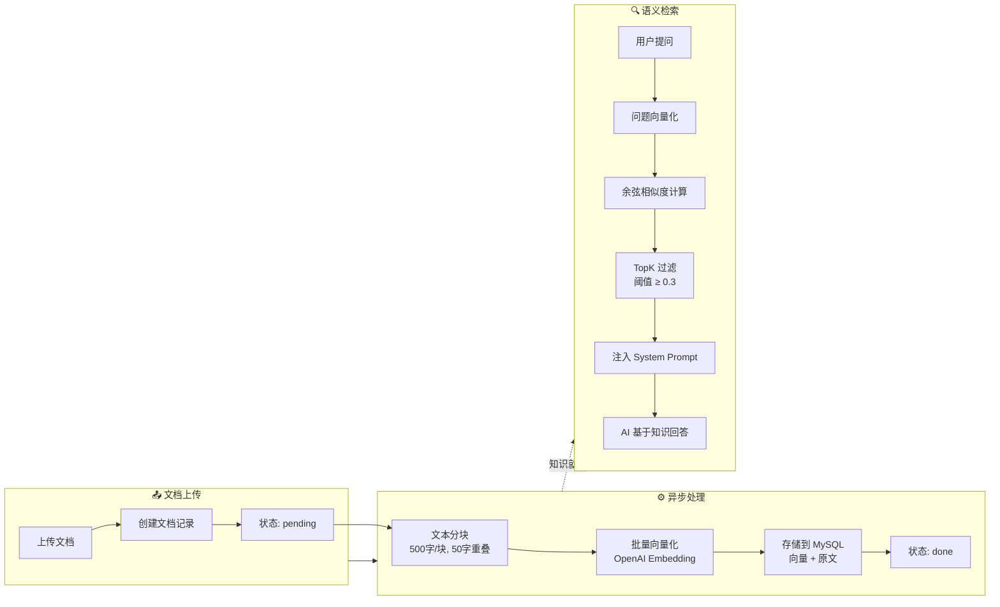
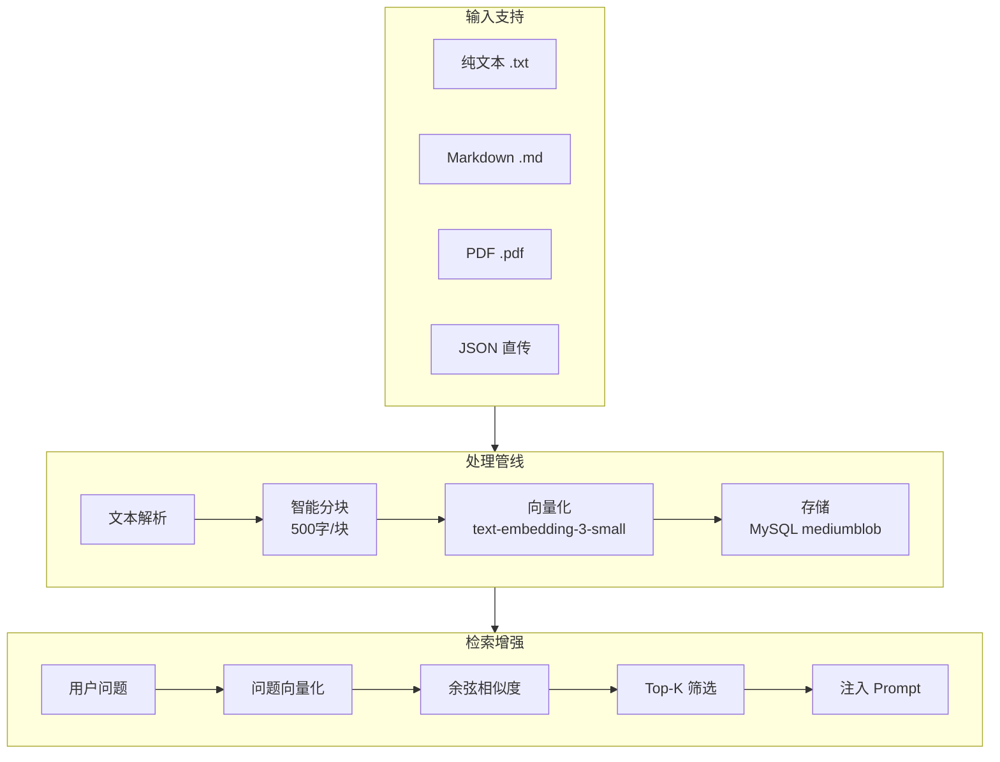
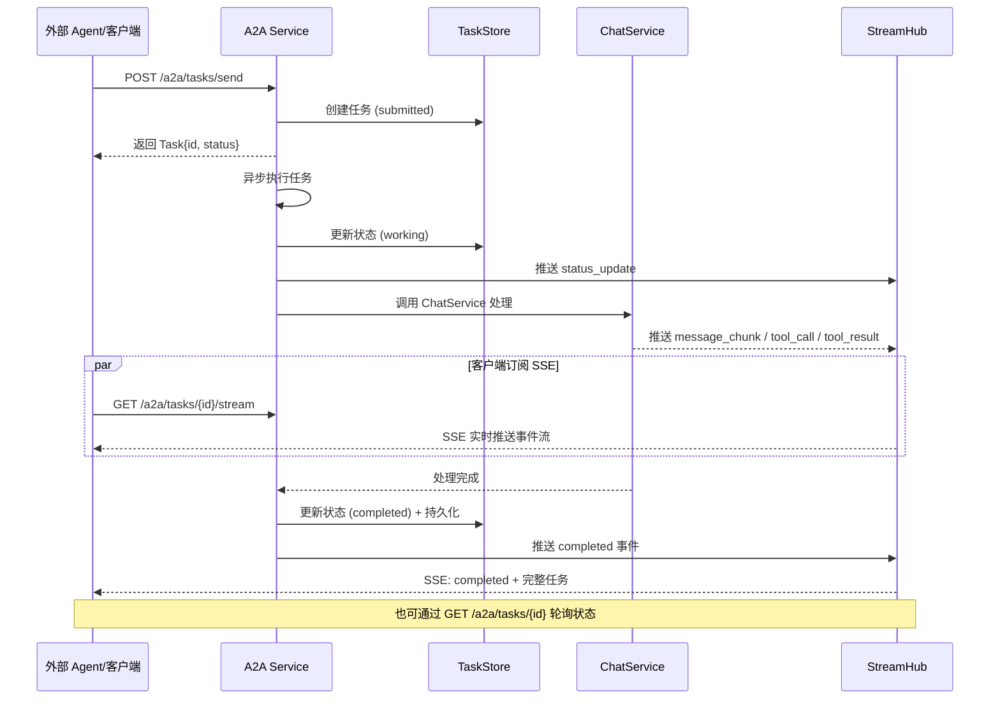
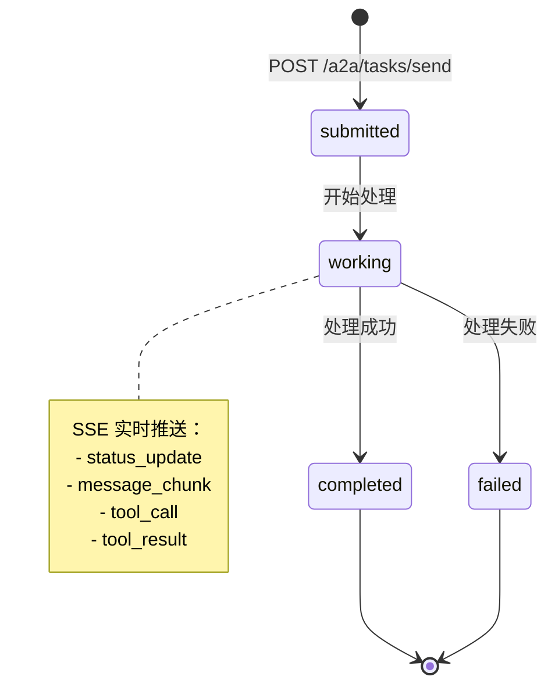
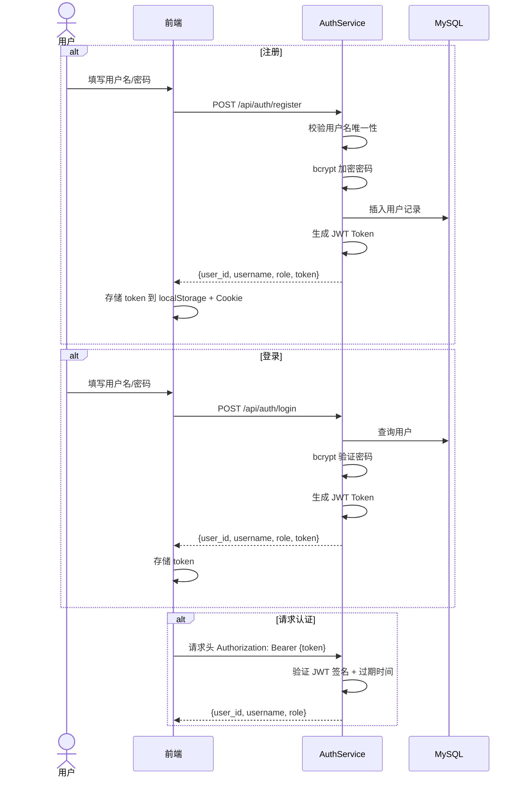
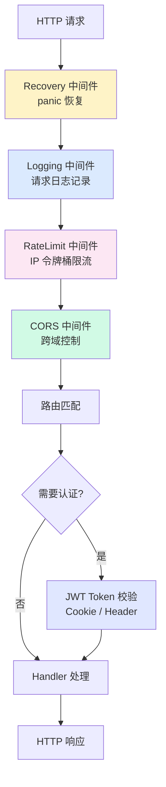

# 🔄 核心流程图集

> 本文档集中展示系统各核心流程的时序图和流程图，帮助理解系统运行机制。

## 目录

- [聊天 + 工具调用时序图](#1-聊天--工具调用时序图)
- [多 Agent 编排流程](#2-多-agent-编排流程)
- [RAG 知识库处理流程](#3-rag-知识库处理流程)
- [A2A 协议任务流程](#4-a2a-协议任务流程)
- [用户认证流程](#5-用户认证流程)
- [请求处理全链路](#6-请求处理全链路)

---

## 1. 聊天 + 工具调用时序图

展示一次完整的聊天请求从前端发起到最终响应的全过程，包括 RAG 注入和 ReAct 工具调用循环。

### SSE 事件类型说明

| 事件类型 | 说明 | 包含字段 |
|---------|------|---------|
| `chunk` | 流式文本片段 | `content`, `thinking`, `session_id`, `model_name` |
| `thought` | AI 思考过程 | `content`, `step`, `parent_tool_call_id` |
| `tool_call` | 工具调用请求 | `tool_name`, `tool_display_name`, `tool_call_id`, `tool_args`, `step` |
| `tool_result` | 工具执行结果 | `tool_name`, `tool_call_id`, `tool_result`, `step` |
| `done` | 完成信号 | `session_id`, `model_name`, `prompt_tokens`, `completion_tokens`, `total_tokens` |
| `error` | 错误信息 | `error` |

---

## 2. 多 Agent 编排流程

展示主 Agent 如何编排多个子 Agent 协同完成复杂任务，以及事件透传机制。

### Agent 注册架构

---

## 3. RAG 知识库处理流程

展示文档从上传到向量化存储，再到语义检索增强 AI 回答的完整流程。

### 知识库数据流

---

## 4. A2A 协议任务流程

展示外部 Agent/客户端通过 A2A 协议与本系统交互的完整流程。

### A2A 任务状态机

---

## 5. 用户认证流程

---

## 6. 请求处理全链路

展示一个 HTTP 请求从进入到响应的完整中间件链路。

