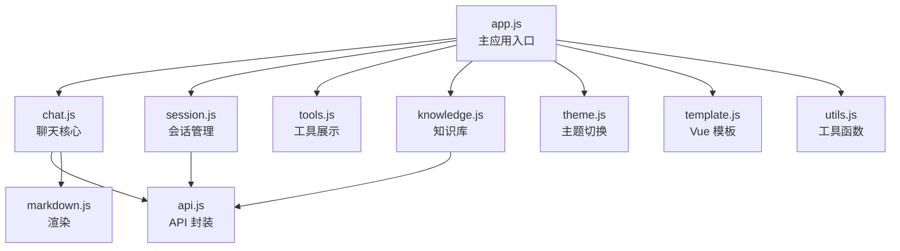

# 🖥️ 前端功能说明

> 本文档详细介绍前端各页面的功能模块和交互逻辑。

## 技术架构

前端采用 **零构建** 方案，通过 CDN 直接引入依赖，无需 Node.js 和构建工具：

| 技术 | 版本 | 用途 |
|------|------|------|
| Vue 3 | CDN | 响应式 UI 框架 |
| Element Plus | CDN | UI 组件库 |
| marked.js | CDN | Markdown 渲染 |
| highlight.js | CDN | 代码语法高亮 |
| SSE | 原生 | 流式接收 AI 回复 |

---

## 页面结构

```
frontend/
├── index.html          # 主聊天界面
├── login.html          # 登录/注册页面
├── knowledge.html      # 知识库管理页面
├── style.css           # 全局样式（含暗色主题）
└── js/
    ├── app.js          # Vue 3 主应用入口
    ├── api.js          # API 请求封装
    ├── chat.js         # 聊天核心逻辑（SSE 处理）
    ├── session.js      # 会话管理
    ├── tools.js        # 工具调用展示
    ├── knowledge.js    # 知识库交互
    ├── markdown.js     # Markdown 渲染配置
    ├── theme.js        # 主题切换
    ├── template.js     # Vue 模板
    └── utils.js        # 工具函数
```

---

## 主聊天界面（index.html）

### 功能模块

#### 1. 聊天对话

- **流式输出**：通过 SSE 实时接收 AI 回复，逐字渲染
- **Markdown 渲染**：支持代码高亮、表格、列表等
- **消息操作**：复制消息、重新生成、停止生成
- **对话轮次**：显示当前对话轮次计数
- **欢迎页**：新会话显示建议问题卡片

#### 2. 工具调用展示

- **ReAct 步骤分组**：按步骤分组展示思考→工具调用→工具结果
- **折叠/展开**：工具调用详情可折叠
- **子 Agent 透传**：多 Agent 模式下，子 Agent 的工具调用嵌套展示
- **工具图标**：每种工具有对应的 emoji 图标

#### 3. 侧边栏

- **会话列表**：显示最近 20 个会话
- **会话搜索**：按标题模糊搜索
- **新建会话**：一键创建新对话
- **会话操作**：重命名、删除
- **历史抽屉**：查看完整历史会话列表和消息详情

#### 4. 模型切换

- **云端模型**：阿里云 DashScope 等
- **本地模型**：Ollama 本地模型（实时拉取）
- **记忆选择**：自动记住上次选择的模型

#### 5. System Prompt

- **自定义 Prompt**：为当前会话设置 System Prompt
- **持久化**：保存到服务端，切换会话自动恢复

#### 6. 知识库选择

- **下拉选择**：选择要绑定的知识库
- **RAG 增强**：选中后聊天自动启用语义检索增强

#### 7. 工具/Agent 管理抽屉

- **工具列表**：查看所有已注册工具
- **Agent 列表**：查看所有 Agent 及其工具配置
- **动态配置**：可视化修改 Agent 的工具列表

#### 8. 状态栏

- **连接状态**：实时显示与后端的连接状态
- **Token 统计**：显示用户累计 Token 消耗
- **用户信息**：显示当前登录用户和角色

---

## 登录/注册页面（login.html）

### 功能

- **登录**：用户名 + 密码登录
- **注册**：新用户注册
- **表单验证**：前端校验用户名和密码格式
- **自动跳转**：登录成功后自动跳转到聊天页面
- **Token 存储**：JWT Token 存储到 localStorage 和 Cookie

---

## 知识库管理页面（knowledge.html）

### 功能

- **知识库 CRUD**：创建、查看、删除知识库
- **文档管理**：上传、查看、删除文档
- **文件上传**：支持 `.txt`、`.md`、`.pdf` 文件
- **处理状态**：显示文档处理状态（pending → processing → done）
- **语义搜索测试**：手动输入问题测试检索效果

---

## 主题系统

### 支持的主题

- **亮色主题**：默认主题
- **暗色主题**：深色背景，护眼模式

### 特性

- **一键切换**：顶部工具栏切换按钮
- **自动记忆**：通过 localStorage 记住用户偏好
- **CSS 变量**：通过 CSS 自定义属性实现主题切换，无闪烁

---

## 模块化设计

前端代码按功能拆分为独立模块，通过 Composition API 组合：



### 模块职责

| 模块 | 职责 |
|------|------|
| `app.js` | Vue 应用初始化、状态管理、生命周期 |
| `chat.js` | SSE 流式处理、消息发送/接收、ReAct 步骤分组 |
| `session.js` | 会话列表、历史记录、重命名/删除 |
| `tools.js` | 工具列表加载、Agent 管理、工具图标映射 |
| `knowledge.js` | 知识库列表、选择绑定 |
| `api.js` | 统一 API 请求封装、认证头注入 |
| `markdown.js` | marked.js 配置、代码高亮、安全过滤 |
| `theme.js` | 主题切换、偏好持久化 |
| `template.js` | Vue 模板字符串（HTML 结构） |
| `utils.js` | 通用工具函数（格式化等） |
